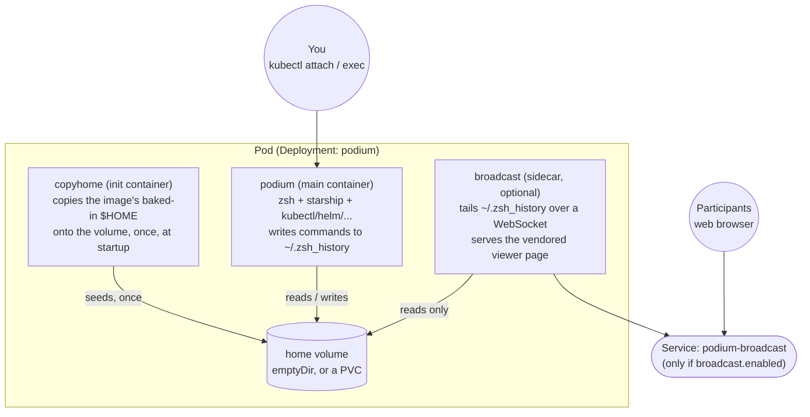

# podium

[](https://github.com/platformfix/podium/actions/workflows/image.yml)
[](https://github.com/platformfix/podium/actions/workflows/e2e.yml)
[](https://github.com/platformfix/podium/actions/workflows/commit-lint.yaml)
[](https://github.com/platformfix/podium/actions/workflows/pr-lint.yml)
[](https://scorecard.dev/viewer/?uri=github.com/platformfix/podium)
[](https://github.com/platformfix/podium/releases)
[](LICENSE)

A shell in a pod for delivering Kubernetes training, with a self-hosted live-terminal broadcast so participants can watch your commands as you type them.

Built by [Platform Fix](https://platformfix.com) for our own Kubernetes classes, and shared publicly because we point students at it.

## What this is

On your own teacher cluster:

```bash
git clone https://github.com/platformfix/podium && cd podium
make presenter
```

`make presenter` installs the chart with `cluster-admin` and the broadcast sidecar turned on, waits for it to be ready, and attaches you to it, all in one step. Everything you type from there runs from inside your own cluster, with `kubectl`, `helm`, and the rest of the toolchain preconfigured. The shell is zsh with a starship prompt, so it looks and feels like a normal terminal rather than a bare container.

Once attached, share the broadcast page's URL with your class: they'll see a live-updating page showing each command as you run it, no install, no login, just the URL.

With `kubectl exec`, use `-- login -f -p k8s`, not `-- sh` or `-- bash` - see [architecture](docs/architecture.md) for why the `-p` matters and what each container in the Pod is for.

## How it fits together



For more on why each container exists, how the broadcast mechanism works, and why podium isn't just shpod, see [docs/architecture.md](docs/architecture.md).

## Installing

### `make presenter` / `make attendee`

The Makefile wraps the full install, from a clean clone to being attached, for the two people who actually run this: you, and each attendee.

| Target | Who it's for | What it sets |
|---|---|---|
| `make presenter` | You, on your teacher cluster | `cluster-admin`, broadcast sidecar on (`NodePort`) |
| `make attendee` | Each attendee, on their own dedicated cluster | `cluster-admin`, a persistent `$HOME`, broadcast off |

```bash
git clone https://github.com/platformfix/podium && cd podium
make attendee
```

That's the whole onboarding step for an attendee: clone, `make attendee`, and they're attached to a ready-to-use shell. Both targets add the Helm chart repo automatically, and both install into a `podium` namespace rather than whatever the cluster's default happens to be. Override `RELEASE_NAME`, `NAMESPACE`, or `HELM_REPO_URL` as `make` variables if you need something other than the defaults.

### By hand, from the chart repo

```bash
helm repo add platformfix https://platformfix.github.io/podium
helm upgrade --install podium platformfix/podium --namespace podium --create-namespace
kubectl wait deployment/podium --namespace podium --for=condition=Available
kubectl attach -it deployment/podium --namespace podium -c podium
```

### Or straight from a clone, without the chart repo

```bash
git clone https://github.com/platformfix/podium
helm upgrade --install podium ./podium/helm/podium --namespace podium --create-namespace
```

For every setting, what it does, and how attendee clusters differ from the trainer's, see [docs/configuration.md](docs/configuration.md).

## What's in the image

Alpine-based, multi-arch (`amd64`/`arm64`), built and published to `ghcr.io/platformfix/podium` on every push to `main` and every tag.

- kubectl, Helm, Kustomize
- k9s, stern, kube-linter, popeye
- ArgoCD CLI, Flux CLI, Velero CLI
- kubeseal, crane, regctl
- kubecolor, jq, yq, git, fzf, vim, tmux
- zsh + starship
- [kubectl-mcp-server](https://github.com/rohitg00/kubectl-mcp-server), so an MCP-capable AI client can operate the cluster through the pod's own credentials

Run `cat ~/versions.txt` inside the pod for exact installed versions.

## Supply chain security

Every image and chart release is signed and attested (build provenance and an SBOM), and the repo runs an OpenSSF Scorecard check on every push (badge above). See [docs/supply-chain.md](docs/supply-chain.md) for verification commands, and [SECURITY.md](SECURITY.md) to report a vulnerability.

## Contributing

See [CONTRIBUTING.md](CONTRIBUTING.md). Commits and pull request titles must follow [Conventional Commits](https://www.conventionalcommits.org/); this is enforced by CI.

## License

[MIT](LICENSE)
