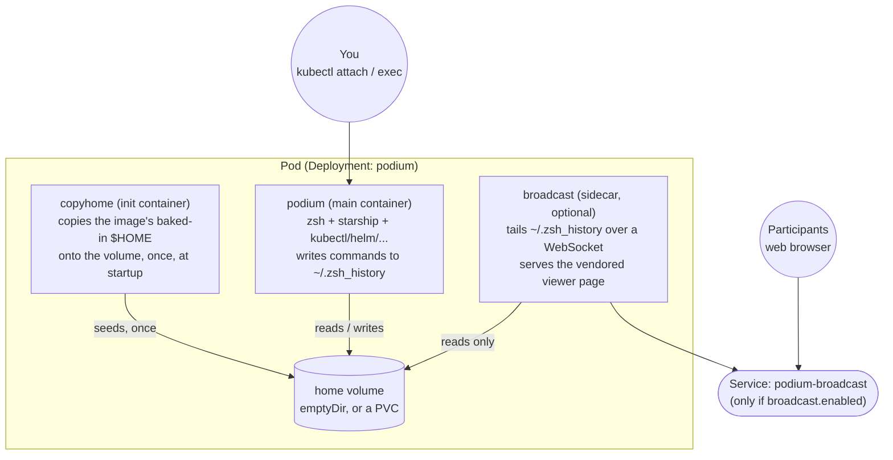

# Architecture

## Pod layout

Every podium Pod has the same three-part shape:

- **`copyhome`** is an init container. The image bakes a default `$HOME` (zshrc, starship config, aliases) into `/home/k8s`, but mounting a volume at that same path would otherwise shadow it with an empty directory. `copyhome` runs once, before the main container starts, and copies that baked-in content onto the volume so it's there regardless of whether the volume is a fresh `emptyDir` or an existing PVC.
- **`podium`** is the container you actually attach to. It's the same image as `copyhome`, just running the entrypoint instead: when a TTY is present (which `kubectl attach` and `kubectl exec ... -- login -f -p k8s` both provide), it logs in as the `k8s` user and hands you a zsh shell. Every command you run gets written to `~/.zsh_history` as it happens, not just on exit.
- **`broadcast`** is an optional sidecar, added only when `broadcast.enabled=true`. It mounts the same home volume read-only and tails `~/.zsh_history` over a WebSocket, serving a small vendored HTML page that renders each line as it arrives. This replaces shpod's `setup-tailhist.sh`, a script you'd otherwise run by hand to patch the Service and fetch a viewer page from a different repo at runtime. Here it's declarative chart configuration, and everything it serves is vendored in this repo's own image.

Nothing about this depends on the broadcast being on: `podium` and `copyhome` are always present; `broadcast` and its Service exist only when you ask for them.

## Why not just use shpod?

[shpod](https://github.com/jpetazzo/shpod) is a great tool, and podium borrows its overall shape: a container image plus a Helm chart, multi-arch, deployed straight onto a cluster. It's built for a different job, though: it hands an isolated shell to *each* student, reachable over SSH. podium is narrower on purpose: one pod, for the trainer, attached to with `kubectl` rather than SSH, with the terminal broadcast built into the chart instead of a manual setup script.

That said, the same chart works for attendees too, when each of them has their own dedicated cluster for the training rather than sharing the trainer's - see [`examples/attendee-cluster-values.yaml`](../examples/attendee-cluster-values.yaml) and `make attendee` in the main [README](../README.md).
